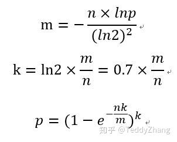

# Algorithm - Bloom Filter

Created by : Mr Dk.

2020 / 12 / 08 22:43

Nanjing, Jiangsu, China

---

## About

**布隆过滤器** 是一个空间利用率较高的概率性数据结构，由 [*Burton Howard Bloom*](https://en.wikipedia.org/w/index.php?title=Burton_Howard_Bloom&action=edit&redlink=1) 在 1970 年提出，其主要用途是，**判断一个元素是否属于一个集合**。

这是一个概率性数据结构是因为，返回的结果中可能存在 false positive，但不可能存在 false negative：即，返回的结果只可能是 **可能在集合中** 和 **肯定不在集合中**。也就是说，如果没有得到 *肯定不在集合中* 的答案，并不代表集合中一定有这个元素。其空间利用率高是因为，使用了 bitmap 来压缩空间。另外，元素被加到一个集合中，就不能再删除了。

上述特性与布隆过滤器的实现密切相关。

## Implementation

首先，布隆过滤器包含如下两个部分：

* 一个巨大的 bitmap，长度为 `m`，其中的每一位不是 0 就是 1
* `k` 个 **相互独立** 的 hash 函数

对于每一个要添加到集合中的元素，分别用 `k` 个 hash 对该元素进行散列，然后将得到的结果对 `m` 取余，即：`index = hash(input) % m`。将 bitmap 中这 `k` 个下标上的位 set 为 `1`。

要判断一个元素是否在集合中时，对该元素使用同样的 `k` 个 hash 函数，并对 `m` 取余：

* 如果得到的 `k` 个下标对应的位 **只要有一个为 `0`**，就可以确定该元素不在集合中 (因为如果元素存在，这些位必不为 `0`)
* 如果下标对应的所有位都为 `1`，那么只能说明该元素可能存在于集合中，也有可能不存在，因为可能只是集合中的其它元素的存在把该元素对应的所有下标位给碰撞了

布隆过滤器节省空间体现在，对于数量为 `n` 的数据，bitmap 只需要 `n / 8` 个字节就能存放。另外，布隆过滤器的时间复杂度低下：只需要计算 `k` 个 hash 的值，然后就可以进行 O(1) 复杂度的查询。

既然这是一个概率模型，该如何保证预测的失误率呢？

## Parameters

预测的准确率与以下几个因素有关：

* Bitmap 的大小 - bitmap 较小，则发生 hash 碰撞的概率就会变高，预测将更加不准确
* Hash 函数的个数 - hash 函数越多，添加每个元素时 set 的位数量越多，越可能发生碰撞

有以下的计算公式：

* `m` 为 bitmap 的大小
* `k` 为 hash 函数的个数
* `p` 为可容忍的误判率

## Application

布隆过滤器可以用于防止 *缓存穿透*。对于 *Redis* 等缓存来说，其主要作用在于将海量请求挡在数据库以外。对于缓存中没有的数据，从数据库中将数据 fetch 到缓存内后，缓存应当可以将之后所有对该数据的访问挡在数据库外。如果有恶意请求利用这个特性，偏偏专门访问一个数据库中不存在的数据，从而可以每次都穿透缓存，访问数据库，降低系统性能。

在这种情况下，就可以使用布隆过滤器将这类请求挡掉：将数据库中的所有 key 加入到布隆过滤器中，并将过滤器挡在缓存之前。对于确定不存在的数据，甚至连缓存都不需要查，直接返回不存在即可。

---

## References

[知乎专栏 - 数学之美：布隆过滤器](https://zhuanlan.zhihu.com/p/72378274)

[Wikipedia - Bloom Filter](https://en.wikipedia.org/wiki/Bloom_filter)

---

