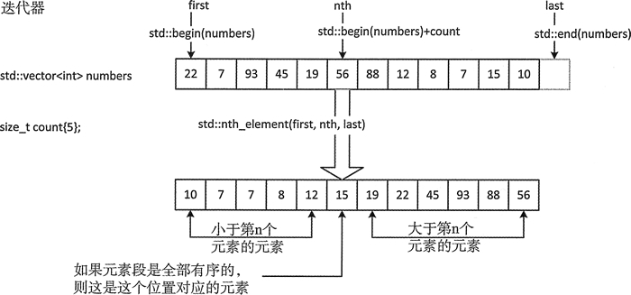

# C++ STL vector

Created by : Mr Dk.

2018 / 03 / 21 23:03

Nanjing, Jiangsu, China

---

## Definition

* 顺序存储容器
* 动态大小数组​

模板定义：

```c++
template < class T, class Alloc = allocator<T> > class vector;
```

需要的头文件：

```c++
#include <vector>
using namespace std; // OR : std::vector
```

## Declaration

```c++
vector<int> vector; // 空的 vector
vector<int> vector(n); // n 个元素的 vector，若 <> 内为对象，则调用构造函数初始化
vector<int> vector(n, number); // n 个元素的 vector，并赋值为 number
vector<int> vector(another_vector); // 拷贝构造函数
vector<int> vector = { 1, 2, 3 }; // 常量拷贝构造，列表中的元素内容必须相容
vector<int> vector(iter.begin(), iter.end()); // 迭代器拷贝构造
```

## Memory Allocation

```c++
vector.reserve(n); // 预留 n 个元素的内存空间，但不创建元素，因此访问预留的空间是非法的
vector.push_back(1); // 可以与 push_back() 方法配合使用 (元素创建在这里发生)
```

```c++
vector.resize(n); // 分配 n 个元素的内存，并建立对象
vector.resize(n, 0); // 分配 n 个元素的内存，并建立对象，赋值
```

## Attributes

```c++
int size = vector.size(); // vector 的长度

bool empty = vector.empty(); // vector 是否为空
```

## Iterator

```c++
vector<int>::iterator vector_iter; // 正向迭代器
vector_iter = vector.begin(); // 指向头一个元素的迭代器
vector_iter = vector.end(); // 指向最后一个元素的下一个位置的迭代器

vector<int>::reverse_iterator reverseIter; // 反向迭代器
reverseIter = vector.rbegin(); // 指向最后一个元素的反向迭代器
reverseIter = vector.rend(); // 指向第一个元素前一个位置的反向迭代器
```

```c++
vector<int>::iterator iter; // 正向迭代器

// 遍历
for (iter = vector.begin(); iter != vector.end(); iter++) {
    cout << *iter << endl;
}

vector<int>::reverse_iterator r_iter; // 反向迭代器

// 遍历
for (r_iter = vector.rbegin(); r_iter != vector.rend(); r_iter++) {
    cout << *r_iter << endl;
}
```

## Compare

如果 vector 内使用 C++ 内置类型进行修饰，那么可以直接使用 `==`、`!=`、`<=`、`<`、`>=`、`>` 来比较两个 vector，将会对 vector 内的元素进行比较，返回字典序的比较结果。

## Modification

```c++
// 若超出内存范围，则自动重新分配内存
// 在知道插入数量的情况下，提前使用 reserve 函数预留内存，避免内存重新分配，效率更高
vector.push_back(1);
vector.pop_back(); // 在尾部删除

vector.insert(iter, 1); // 在 iter 的位置前插入元素
vector.insert(iter, n, 1); // 在 iter 的位置前插入 n 个元素
vector.insert(iter, iter_begin, iter_end); // 在 iter 的位置前插入 [begin, end) 的元素

vector.erase(iter); // 删除 vector_iter 指向的元素
vector.erase(iter_begin, iter_end); // 删除 [begin, end) 中的元素

vector.clear(); // 删除全部
```

## Assignment

```c++
vector<int> vector1 = vector2; // 已重载 = 运算符
vector1.assign(vector2.begin(), vector2.end());
```

## Data Access

```c++
cout << vector.front() << endl; // 第一个元素
cout << vector.back() << endl; // 最后一个元素

// 随机访问
cout << vector.at(pos) << endl;
cout << vector[pos] << endl;
```

## Algorithm

```c++
#include <algorithm> // 需要引用头文件
```

### Sort / Reverse

```c++
// 排序
sort(vector.begin(), vector.end());
sort(vector.begin(), vector.end(), greater<int> ());
sort(vector.begin(), vector.end(), compare); // 比较函数 bool compare() 需要自己实现

// 逆置
reverse(vector.begin(), vector.end());
```

### Heap Operation

建立堆的过程中可以使用自定义的二元比较函数，在以下三个函数中都可以使用可选的比较函数 (默认使用 `<` 的运算符)：

* `make_heap()` 用于在一个已有的数组上建堆
* `push_heap()` 对数组中的最后一个元素进行堆调整 (所以之前要调用 `push_back()`)
* `pop_heap()` 将堆顶换到数组的最后一个元素，然后对剩余的数组调整堆序 (之后一般要调用 `pop_back()` 取出堆顶)

```c++
make_heap(vector.begin(), vector.end()); // 建堆 (默认为大顶堆)
make_heap(vector.begin(), vector.end(), greater<int> ()); // 小顶堆

// 堆中添加元素
vector.push_back(1);
push_heap(vector.begin(), vector.end());

// 堆中删除元素
pop_heap(vector.begin(), vector.end());
vector.pop_back();

// 堆排序
sort_heap(vector.begin(), vector.end());
```

### K-Smallest Element

在数组中获取第 k 小 (默认) 的元素。算法默认使用 `<` 运算符生成结果，也可以自定义比较函数。函数执行后，在指定的位置之前的元素全部小于指定位置上的元素，指定位置之后的元素全部大于指定位置上的元素。显然，算法可以使用快速排序中的 pivot 思想，然后对子区间递归。原理如 [下图](http://c.biancheng.net/view/566.html) 所示：



```c++
nth_element(vector.begin(), vector.begin() + n, vector.end(), comp);
```

## Two-Dimension Vector

```c++
vector<vector<int> > graph; // 一般用于表示图的邻接矩阵
```

---

## Summary

适合需要大量随机访问的场合，也可作为已知规模数据的静态存储方式。

---

