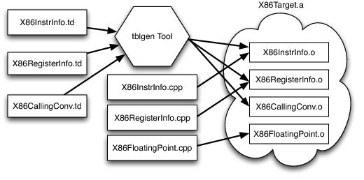

# Compiler - LLVM Architecture

Created by : Mr Dk.

2019 / 05 / 23 11:09

Nanjing, Jiangsu, China

---

## Architecture

### Traditional


### LLVM


---

## Existing Language Implementation

在 LLVM 出现之前，所有的开源语言实现无法共享代码

或只针对其支持的特定源语言

在传统编译器架构下，有三个看起来比较成功的案例

### Java & .NET Virtual Machine

这些系统提供：

* JIT (Just-In-Time) Compiler
* Runtime Support
* Well-defined Bytecode Format

任何可以编译为 bytecode 的语言，都可以重用优化器、JIT、Runtime

导致了编译不符合这类模型的语言时性能下降

### Unfortunate but Popular Way to Reuse

将输入源文件翻译为 C 代码，并输入 C 编译器中

* 实现有效的异常处理很难
* 较差的 debug 体验
* 编译速度变慢
* 对于 C 不支持的特性可能会引发问题

### GCC

GCC 被设计为一个整体的应用

无法将 GCC 嵌入到其它应用中

* 作为 run-time/JIT
* 提取或重用部分功能
* 想用 GCC 做代码分析的人不得不使用整个 GCC

GCC 无法以库的形式被重用

* 大量全局变量的使用
* 设计简陋的数据结构
* 繁重的代码量
* 大量使用宏

分层问题：

* 后端依赖前端的 AST 产生调试信息
* 前端产生后端的数据结构
* 整个编译器依赖命令行接口建立的全局数据结构

---

## LLVM IR

LLVM IR 是 LLVM 在编译器中表示代码的方式

设计目标：

* 支持轻量级的 run-time 优化
* 跨函数 / 跨过程优化
* 整体程序优化

定义完善的中间语言

C 程序：

```c
unsigned add1(unsigned a, unsigned b) {
    return a+b;
}

// Perhaps not the most efficient way to add two numbers.
unsigned add2(unsigned a, unsigned b) {
    if (a == 0) return b;
    return add2(a-1, b+1);
}
```

LLVM IR：

```
define i32 @add1(i32 %a, i32 %b) {
entry:
    %tmp1 = add i32 %a, %b
    ret i32 %tmp1
}

define i32 @add2(i32 %a, i32 %b) {
entry:
    %tmp1 = icmp eq i32 %a, 0
    br i1 %tmp1, label %done, label %recurse
recurse:
    %tmp2 = sub i32 %a, 1
    %tmp3 = add i32 %b, 1
    %tmp4 = call i32 @add2(i32 %tmp2, i32 %tmp3)
    ret i32 %tmp4
done:
    ret i32 %b
}
```

LLVM IR 是一个低层的类 RISC 虚拟指令集

* 三地址形式
* 支持类似汇编中的 label

与大部分 RISC 指令集不同

* LLVM 拥有一个简单的类型系统
  * `i32` 是一个 32-bit integer
  * `i32**` 是一个指向 32-bit integer 的指针的指针
* 调用被抽象为带有指定类型参数的 `call` 和 `ret`
* 不使用固定数量的寄存器
  * 使用无限的暂存单元，以 `%` 表示

LLVM IR 拥有三种同构形式：

* 文字形式 - `.ll`
* 内存数据结构形式
* 高效、高密度的磁盘 bitcode 格式 - `.bc`

`llvm-as` 将 `.ll` 转换为 `.bc`

`llvm-dis` 将 `.bc` 转换为 `.ll`

LLVM IR 为编译器提供了一个 __极乐世界__

* 优化器不被源语言或目标平台约束

在另一个角度来说，LLVM IR 必须被设计得足够好

* 需要足够简单，以便从前端语言生成
* 需要足够有表现力，以便优化器针对特定的目标平台进行优化

---

## LLVM Optimization

大部分优化遵循三个部分：

* 找到要被转换的模式
* 检验转换是否是安全的 / 正确的
* 进行转换，更新代码

举例 - 减法优化

* `X - X` 可被优化为 `0`
* `X - 0` 可被优化为 `X`
* `(X * 2) - X` 可被优化为 `X`

LLVM IR 形式：

```
%example1 = sub i32 %a, %a

%example2 = sub i32 %b, 0

%tmp = mul i32 %c, 2
%example3 = sub i32 %tmp, %c
```

LLVM 向高层语言提供指令简化接口进行转换：

```c++
// X - 0 -> X
if (match(Op1, m_Zero()))
    return Op0;

// X - X -> 0
if (Op0 == Op1)
    return Constant::getNullValue(Op0->getType());

// (X*2) - X -> X
if (match(Op0, m_Mul(m_Specific(Op1), m_ConstantInt<2>())))
    return Op1;

return 0; // Nothing matched, return null to indicate no transformation.
```

其中，`Op0` 和 `Op1` 分别为左右操作数

`match()` 和 `m_()` 函数都可以进行模式匹配

于是，实现了一个减法优化的 `SimplifySubInst()` 函数

该函数的调用者是一个分发器

* 根据指令的操作码，分发对应指令的每一个优化函数

```C++
for (BasicBlock::iterator I = BB->begin(), E = BB->end(); I != E; ++I)
    if (Value *V = SimplifyInstruction(I))
        I->replaceAllUsesWith(V);
```

---

## LLVM Implementation

### Architecture

在 LLVM 架构下

* 前端负责语法分析、语法检验、错误诊断，将代码转换为 AST，再转换为 LLVM IR
* IR 被 Optimization passes 优化
* 后端负责目标平台机器码的生成

LLVM IR 是优化器能获得的完全且唯一的接口

### Collection of Libraries

LLVM 被设计为一个库的集合，而不是像 GCC 或 JVM 那样整个的命令行编译器

优化器的实现：

* 以 IR 作为输入，对 IR 进行处理，输出更优化的 IR
* 优化器被组织为多个独立的 optimization passes 的流水线形式
* 每个 pass 都有机会对输入进行处理
* 根据优化等级可运行不同的 passes

每个 pass 被实现为 `Pass` 类的子类

* 每个类都在各自内部的匿名命名空间中
* 需要暴露一个实例化 pass 函数

```c++
namespace {
    class Hello : public FunctionPass {
    public:
    // Print out the names of functions in the LLVM IR being optimized.
        virtual bool runOnFunction(Function &F) {
            cerr << "Hello: " << F.getName() << "\n";
            return false;
        }
    };
}

FunctionPass *createHelloPass() { return new Hello(); }
```

Passes 被编译为一个或多个 `.o` 文件，然后被构建为 archive libraries (`.a` in Unix)

* Passes 之间松耦合
  * 要么完全独立
  * 要么明确声明依赖的其它 passes

LLVM PassManager 根据声明找到所有的依赖

基于 library 的设计允许实现者选择特定的 pass 及其执行顺序，进行特定的优化，比如：

* 如果所有代码都在一个大函数体内，就不需要浪费时间使用 `inline` pass 了
* 如果几乎没有指针，那么指针分析也不需要了
* ...

LLVM PassManager 不知道每个 pass 中的具体细节

* 开发者可以自由实现针对某种语言的优化 pass

在对应的 passes 被选定后，编译器被构建为可执行的动态库

* 每个 pass 的 `.o` 中声明了 `create()` 函数
* 每个优化器存在于库 `.a` 中
* 只有实际被用到的 passes 及其依赖才会被链接进来


独立优化器的思想

* LLVM 提供很多库，但不知道如何使用它们
* 库的使用者 (e.g. Clang) 决定如何使用这些库，已达到最好的效果

---

## LLVM Code Generator

LLVM 的 code generator 负责用 IR 生成对应平台的机器码

* 每个平台的 code generator 应当是完全独立的
* 同时，它们也需要解决类似的问题
  * 向寄存器赋值

LLVM 将代码生成问题拆分为独立的 passes

* 指令选择
* 寄存器分配
* 安排
* 代码布局优化
* 汇编
* 其它默认运行的内置 passes

开发者可以：

* 选择默认的 passes
* 覆盖默认的 passes
* 实现特定平台的自定义 passes

LLVM 为每一个平台提供一个目标描述语言，形容每个平台的信息

* target description (`.td` files)

比如，x86 平台的所有寄存器信息：

```
def GR32 : RegisterClass<[i32], 32,
    [EAX, ECX, EDX, ESI, EDI, EBX, EBP, ESP,
     R8D, R9D, R10D, R11D, R14D, R15D, R12D, R13D]> { … }
```

* 定义了寄存器位数、名称

某条指令的信息：

```
let Constraints = "$src = $dst" in
def NOT32r : I<0xF7, MRM2r,
    (outs GR32:$dst), (ins GR32:$src),
    "not{l}\t$dst",
    [(set GR32:$dst, (not GR32:$src))]>;
```

* 指令名 - `NOT32r`
* 编码信息 - `0xF7`
* 输入 / 输出分别来自 32-bit 寄存器
* 汇编格式
* 首行 `let` 表示寄存器使用的约束（必须使用同一个物理寄存器）

将所有的 `.td` 文件输入 `tblgen` 工具：



此外，还需要开发者写一些 `.cpp`，实现特定平台的优化 passes

共同编译为后端的库

---

## Reference

<http://www.aosabook.org/en/llvm.html>

---

## Summary

对 LLVM 的设计更加了解了一些

特别是了解了 LLVM IR 的具体形式

以及编译器总体的构建过程

LLVM 基于 library 的设计

在实际中为开发者提供了很多自定义的机会

我觉得这种设计思想很前卫

---

