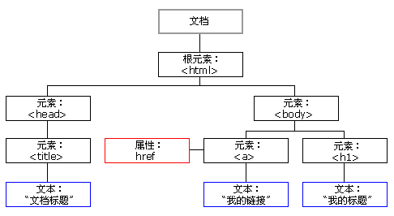

# Front-end - HTML DOM

Created by : Mr Dk.

2019 / 02 / 21 17:15

Nanjing, Jiangsu, China

---

### About

__文档对象模型（Document Object Model, DOM）__

DOM 是 _W3C（万维网联盟）_ 的标准

定义了访问 HTML 和 XML 文档的标准：

> W3C 文档对象模型 （DOM） 是中立于平台和语言的接口，它允许程序和脚本动态地访问和更新文档的内容、结构和样式。

W3C DOM 标准分为三部分：

* 核心 DOM - 针对任何结构化文档的标准模型
* XML DOM - 针对 XML 文档的标准模型
* HTML DOM - 针对 HTML 文档的标准模型

---

### HTML DOM

HTML DOM 是：

* HTML 的标准对象模型
* HTML 的标准编程接口

HTML DOM 定义了所有 HTML 元素的 __对象__ 和 __属性__，以及访问它们的 __方法__

HTML DOM 是关于如何 __获取、修改、添加或删除__ HTML 元素的标准

---

### HTML DOM Nodes

在 HTML DOM 中，所有事物都是结点

HTML DOM 将 HTML 文档视为 __树结构__：



使用 JavaScript 可以访问树上的所有结点

所有结点也均可以被修改、创建、删除等

---

### DOM Methods

通过 JavaScript 对 DOM Tree 进行增、删、改、查等

| Methods                    | Description                                                  |
| -------------------------- | ------------------------------------------------------------ |
| `getElementById()`         | 返回带有指定 ID 的元素                                       |
| `getElementsByTagName()`   | 返回包含带有指定标签名称的所有元素的节点列表（集合/节点数组） |
| `getElementsByClassName()` | 返回包含带有指定类名的所有元素的节点列表                     |
| `appendChild()`            | 把新的子节点添加到指定节点                                   |
| `removeChild()`            | 删除子节点                                                   |
| `replaceChild()`           | 替换子节点                                                   |
| `insertBefore()`           | 在指定的子节点前面插入新的子节点                             |
| `createAttribute()`        | 创建属性节点                                                 |
| `createElement()`          | 创建元素节点                                                 |
| `createTextNode()`         | 创建文本节点                                                 |
| `getAttribute()`           | 返回指定的属性值                                             |
| `setAttribute()`           | 把指定属性设置或修改为指定的值                               |

---

### DOM Attributes

#### nodeType

* Read-only

| Node Type | Value |
| --------- | ----- |
| 元素      | 1     |
| 属性      | 2     |
| 文本      | 3     |
| 注释      | 8     |
| 文档      | 9     |

#### nodeName

* Read-only
* HTML 元素的大写字母标签名

| Node Type | Value                |
| --------- | -------------------- |
| 元素      | 标签名 - `a`、`p` 等 |
| 属性      | 属性名 - `href` 等   |
| 文本      | `#text`              |
| 文档      | `#document`          |

#### nodeValue

| Node Type | Value                 |
| --------- | --------------------- |
| 元素      | `undefined` or `null` |
| 属性      | 属性值                |
| 文本      | 文本本身              |

#### innerHTML

```html
<p id="index">Hello World!</p>

<script>
var txt = document.getElementById("index").innerHTML;
document.write(txt);    // "Hello World!"
</script>
```

__ATTENTION:__

`<p>` 结点和文本结点 `Hello World!` 有父子结点关系

因此先用 `getElementById()` 获得 `<p>` 结点

再用 `innerHTML` 操作其中文本结点的内容

---

### DOM Modifications

#### Insert Nodes

```html
<div id="d1">
<p id="p1">This is a paragraph.</p>
<p id="p2">This is another paragraph.</p>
</div>

<script>
var para=document.createElement("p");
var node=document.createTextNode("This is new.");
para.appendChild(node);

var element=document.getElementById("d1");
element.appendChild(para);
</script>
```

#### Modify Content

```html
<html>
<body>

<p id="p1">Hello World!</p>

<script>
document.getElementById("p1").innerHTML="New text!";
</script>

</body>
</html>
```

#### Delete Nodes

如果需要删除 HTML 元素，必须清楚该元素的父元素

如果找到了需要删除的子元素，使用 `parentNode` 属性获得父元素

---

### Event

#### 响应事件

```html
<h1 onclick="this.innerHTML='hello!'">Change Inner</h1>
```

```html
<script>
function changetext(id)
{
    id.innerHTML = "hello!";
}
</script>
<h1 onclick="changetext(this)">Change Inner</h1>
```

#### 分配事件

```html
<button onclick="displayDate()">Try</button>
```

```html
<script>
document.getElementById("button").onclick=function(){displayDate()};
</script>
```

#### Event Type

`onclick`、`onload`、`onunload`、`onchange`、`onmouseover`、`onmouseout`、......

---

### Search

利用三个属性在文档结构中进行导航：

* `parentNode`
* `firstChild`
* `lastChild`

此外，还可以使用 `childNodes` 等属性

如果返回的结果不止一个 - 使用下标从 `[0]` 开始依次访问

---

### Summary

开始学习前端 开始学习 Vue.js

需要提前了解一些没有框架之前的东西

才能理解框架给我们做了什么

顺带学一下 JavaScript :sweat_smile:

---

