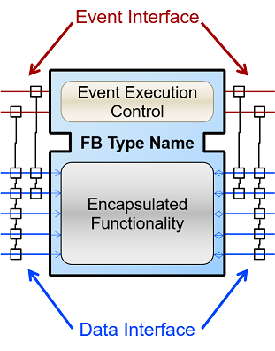
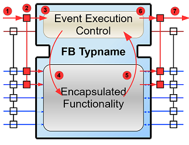
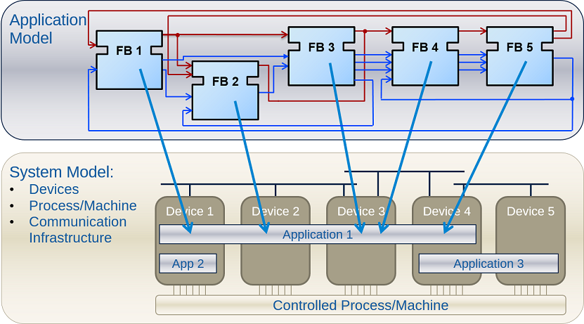
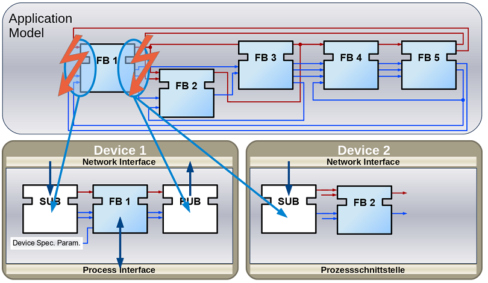
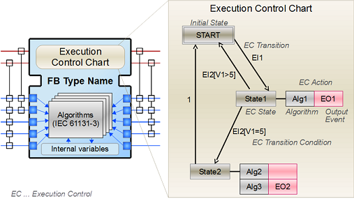
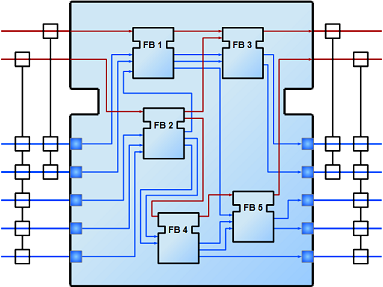
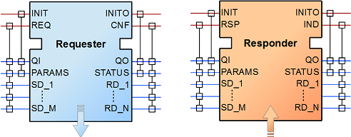

# Standard - IEC 61499

Created by : Mr Dk.

2019 / 02 / 25 16:37

Nanjing, Jiangsu, China

---

### About

> IEC 61499 defines a domain-specific modeling language for developing __distributed__ industrial control solutions. IEC 61499 extends IEC 61131-3 by improving the encapsulation of software components for increased re-usability, providing a vendor independent format, and simplifying support for controller-to-controller communication. Its distribution functionality and the inherent support for dynamic reconfiguration provide the required infrastructure for Industry 4.0 and industrial IoT applications.

---

### FB Interface

New appearance of the FB in __IEC 61499__

* Inputs - on the left
* Outputs - on the right
* Differentiates __events__ & __data__
  * Events trigger the functionalities of the FB
  * Then use the data available at the data inputs
* Connection between event & data
  * Defines which data inputs/outputs are refreshed when input/output event occurs

#### Fan-in & Fan-out

* Fan-in : The connection of several outputs of the previous stage to an input
* Fan-out : An output that is connected to several inputs of the next stage

For data : fan-in is not allowed, fan-out is allowed

For event : both fan-in & fan-out are possible

---

### ECC

The behavior of the FB depends on its ECC (Event Execution Control)

ECC is a __state machine__

---

### FB Internal Sequence

1. An input events arrives at the FB.
2. The data inputs related to the incoming event are refreshed.
3. The event is passed on to the ECC.
4. Depending on the FB type and execution control, internal functionality is triggered for execution.
5. The internal functionality finishes the execution and provides new output data.
6. The output data related to the output event are refreshed
7. An output event is sent.

`4` - `7` may be repeated several times

---

### Distributed Application

* Not all FBs of an application are running on the same device (PLC)
* A device may comprise several __resources__ (threads), running many apps at the same time
* The FBs are actually loaded onto a resource, not the device itself
* A FB cannot be split to several devices

---

### Broken Connections

The data and events need to be sent to the next device in order to maintain their flow

* Fix these connections with special FBs to publish information and subscribe to it
* These new FBs are not part of the full application - only visible in the resource view

---

### Types of Function Blocks

#### Basic Function Block (BFB)

Define a state machine using the Execution Control Chart (ECC)

The ECC decides which algorithm is executed based on its state and the input events

#### Composite Function Block (CFB)

Simply has an internal network of other FBs

#### Service Function Block (SFB)

SFBs are FBs that are needed to __access inputs or outputs and, to communicate, even specific hardware__

They are used for anything that needs to access the platform, which BFBs or CFBs cannot do

Activated not only by an incoming event but also by the hardware

---

### Refrences

https://www.eclipse.org/4diac/en_help.php?helppage=html/before4DIAC/iec61499.html

---

