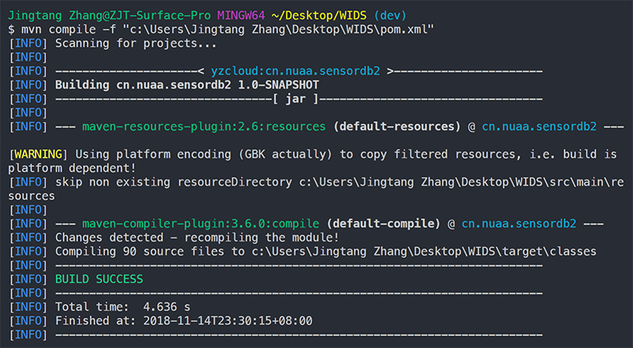
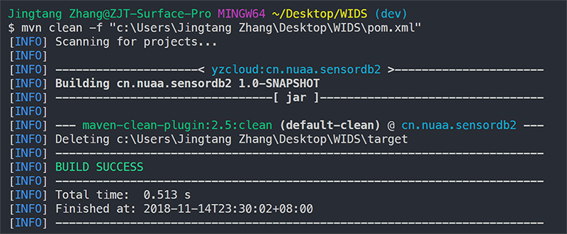

# Java - Maven 项目构建工具

Created by : Mr Dk.

2018 / 11 / 03 15:01

Nanjing, Jiangsu, China

---

## About

_Apache Maven&trade;_ 是一个项目管理和综合工具。提供一个 __项目对象模型文件（POM）__ 的概念来管理项目的构建、相关性和文档。还能够自动下载项目依赖库。

---

## Installation & Configuration

Eclipse 的最新发布版中已经内嵌了 Maven，不需要另外安装

Maven 默认从 __中央存储库__ 自动下载依赖资源 `http://repo1.maven.org/maven2/`

由于国内的网络环境问题，可以修改 Maven 的配置文件，添加国内镜像，从而加快下载速度

官方文档教程：[Apache Maven - Guide to Mirror Settings](http://maven.apache.org/guides/mini/guide-mirror-settings.html )

首先找到 Maven 的 setting file - `${user.home}/.m2/settings.xml` （如果没有需要手动创建）

> 在 Linux 中：`maven/conf/setting.xml` (似乎 Windows 也 OK？？？ 😧)

在配置文件中加入内容，添加国内的阿里云镜像：

```xml
<settings>
  <mirrors>
        
    <mirror>  
      <id>nexus-aliyun</id>  
      <name>Nexus aliyun</name>
      <url>http://maven.aliyun.com/nexus/content/groups/public</url>
      <mirrorOf>central</mirrorOf>  
    </mirror> 
        
  </mirrors>
</settings>
```

---

## Project

在 Eclipse 中新建一个 Maven project

里面有很多个工程模板，根据需求选择（一般选择 `quickstart` 即可）

* 填写 `groupId`、`artifactId`、`version`
* Maven 通过这三个元素唯一确定一个工程
* 同时，`groupId` 和 `artifactId` 也会组合为源代码路径 `/src` 下的默认包名
* 根据需要设置 `JRE System Library`
* 如果需要引入依赖

  * 定位到工程根目录的 `pom.xml` 文件中的 `<dependencies>` 内
  * 加入依赖的定义组 `<dependency>`，其中包括依赖项目的 `groupId`、`artifactId`、`version`，以及 `scope` （部署阶段，若不加则默认所有阶段）
  * 配置保存后 Maven 会将依赖的 `.jar` 文件下载到 _Maven_ 默认的本地存储库下 - `${user.home}/.m2/repository/`

  * `.jar` 文件下载完毕后，会出现在 `Build Path` 的 `Maven Dependencies` 中
  
* 在 `src/` 目录下进行编码即可，依赖的类可以随时被 `import`
* 与当前工程有关的信息全部都在 `pom.xml` 中，包括各子路径的作用等
* 右键工程，点击 `Maven/Update Project` 可重新构建工程并下载依赖

```xml
<project>
  <dependencies>
  
    <dependency>
      <groupId>junit</groupId>
      <artifactId>junit</artifactId>
      <version>3.8.1</version>
      <scope>test</scope>
    </dependency>
    
    <dependency>
      <groupId>io.vertx</groupId>
      <artifactId>vertx-core</artifactId>
      <version>3.5.4</version>
    </dependency>
    
  </dependencies>
</project>
```

---

## Command

在 cmd 中直接运行命令

* `mvn compile` - 将 _Java_ 源文件编译为 `.class` 文件
* `mvn test` - 测试，并生成测试报告
* `mvn clean` - 将以前编译的 `.class` 文件删除
* `mvn package` - 打包
* `mvn install` - 打包并放入 `maven` 本地仓库中
* ...

在 eclipse 中的操作步骤：

* 选择 `Run As`
* 选择 `Maven build `
* 在其中的 `Goals` 中填入对应的命令 - 如 `compile`、`install` 等

在 Visual Studio Code 中的 _Maven for Java_ 插件的帮助下可直接运行命令：


`mvn compile` 命令：



`mvn clean` 命令：



编译前，需要在 `pom.xml` 文件中指定编译所需的 _JDK_ 版本和编码格式

以及指定 `maven-compiler-plugins` 的版本 `<version></version>`

```xml
<build>
  <plugins>
    <plugin>
      <groupId>org.apache.maven.plugins</groupId>
      <artifactId>maven-compiler-plugin</artifactId>
      <version>3.6.0</version>
      <configuration>
        <source>1.8</source>
        <target>1.8</target>
        <encoding>UTF-8</encoding>
      </configuration>
    </plugin>
  </plugins>
</build>
```

---

## Summary

其实以前经常碰到 _Maven_

但是没有花心思研究

今天学习 _Vert.x_ 框架的时候

写了一些 demo 准备上传到 GitHub 上

突然发现工程目录下 `lib/` 里的文件有 80 MB

包括 _Vert.x_ 的各种 `.jar` 文件以及其依赖文件

传上去既影响速度也没有必要

所以研究了一波 Maven

把整个工程构建成 Maven project

就不需要上传依赖的库了

---

