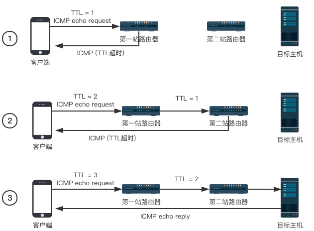

# Network - Traceroute

Created by : Mr Dk.

2018 / 12 / 26 11:24

Nanjing, Jiangsu, China

---

## About

_Traceroute_ 是用来检测从 __发出数据包的主机__ 到 __目标主机__ 之间所经过的 __网关数量__ 的工具

在 _MS Windows_ 下叫做 _tracert_

可以定位从发送主机到目标主机之间的所有路由器

主要原理，操纵数据包中的 `TTL` 字段进行步步试探

_MS Windows_ 下的 _tracert_

* 当前主机的 _IP_ 地址为 `[153.3.101.244]`，尝试对 _Baidu_ 进行 _traceroute_
* 默认参数最大 _TTL_ 为 _30_
* 默认参数对每个 _TTL_ 发出 _3_ 个探测包

## TTL

_TTL_（_Time-To-Live_）是 _IP_ 数据包中的一个字段，指定了数据包最多能经过几次路由器

* _IP_ 数据包每经过一次路由器，`TTL` 的值就会被减掉 `1`
* `TTL` 被减至 `0` 时，该数据包将被路由器丢弃，不再继续转发，同时路由器向源地址发送一个超时报文

## Theory

_Traceroute_ 的原理是，向目的地址发送 `TTL` 从 `1` 开始逐渐增大的数据包

* `TTL == 1` 时，第一跳路由器将会返回超时报文
* `TTL == 2` 时，第二跳路由器将会返回超时报文
* ......
* 直到 `TTL` 的值能够到达目的地址，目的地址返回一个确认信号（可能是不同形式的）
* 或者到达最大 `TTL` 限制，也没有到达目的地址

## Implementation Based on ICMP

发送 _ICMP echo request_，实际上就是 _ping_ 命令

如果 _TTL_ 超时，将会返回 _ICMP-TTL-Exceeded_ 报文

如果到达目的地址，将会返回 _ICMP echo reply_ 报文，暗示 _traceroute_ 结束

可能出现的问题：

* 有些服务器或防火墙会因为安全原因不回复 _ICMP echo reply_
* 有些路由器会 __“安静”__ 地丢掉 _TTL_ 减小到 _0_ 的数据包，即不返回 _TTL_ 超时报文

## Implementation Based on UDP

发送 _UDP_ 数据包，使用一个大于 _30000_ 的端口号

如果 _TTL_ 超时，将返回 _ICMP-TTL-Exceeded_

如果到达目的地址，由于服务器通常不会使用大于 _30000_ 的端口号，将返回 _ICMP-port-unreachable_，暗示 _traceroute_ 结束

可能出现的问题：

* _UDP_ 由于经常被用来做网络攻击（无需连接，没有状态约束），因此 _ISP_ 出于安全考虑会采用端口白名单，只有在白名单端口中的数据包才能通过
* 服务器可能出于安全原因不提供 _UDP_ 服务
* 可能被防火墙过滤

## Implementation Based on TCP

目标端口：_80_ ？

---

## Summary

读论文的时候了解到的技术

实现方式原来可以有很多种

最近在摸的 _[Scapy](https://scapy.net/)_ 工具好像提供 _TCP traceroute_

文中图片来自 _[简书](https://www.jianshu.com/p/75a5822d0eec)_，如有侵权请通知我删除，_thx_

---

