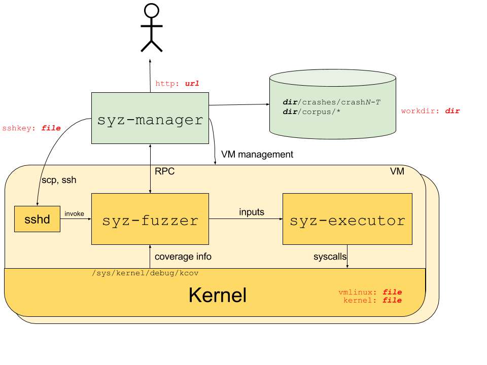

# Fuzzer - syzkaller Architecture

Created by : Mr Dk.

2019 / 07 / 04 15:05

Nanjing, Jiangsu, China

---

## What is syzkaller

__syzkaller__ is an unsupervised, coverage-guided kernel fuzzer by _Google_ implemented in Golang.

Link - https://github.com/google/syzkaller

Supported OSes:

* Akaros
* FreeBSD
* Fuchsia
* gVisor
* Linux
* NetBSD
* OpenBSD
* Windows

最初，syzkaller 被用于 Linux 内核的 fuzzing

---

## How syzkaller Works

红色标签代表对应的配置选项



* syz-manager
  * 该进程启动、监控、重启所有的 VM 实例
  * 在 VM 实例中启动 `syz-fuzzer` 进程
  * 负责维护语料库和 crash 的存储
  * 与 `syz-fuzzer` 相反，运行在一个内核稳定的 host 上，不会受到 fuzzing 的影响
* syz-fuzzer
  * 该进程运行在不稳定的 VM 中
  * 引导 fuzzing 过程的进行
    * 输入产生、改变、最小化
  * 通过 RPC 将触发新 coverage 的输入发送回 `syz-manager`
  * 启动 `syz-executor` 进程
* syz-executor
  * 该进程执行单独的一个输入 (一系列系统调用)
  * 从 `syz-fuzzer` 接受程序并执行，并将结果返回
  * 被设计得尽可能简单 (C++)

---

## Syscall Descriptions

`syz-fuzzer` 进程产生程序，由 `syz-executor` 进行执行

对应的系统调用接口需要在指定目录下被声明

从而使 syzkaller 能够利用这些系统调用接口生成程序

系统调用描述文件位于 syzkaller 目录的 `/sys/:OS/:*.txt` 中

* 比如，`sys/linux/dev_snd_midi.txt` 中包含了 Linux MIDI 接口的描述

---

## Crash Reports

syzkaller 发现 crash 后，将会把信息保存到 `workdir/crashes` 中

该目录下的每一个子目录都代表了一次单独的 crash，由唯一的字符串表示

用于调试和复现

```
 - crashes/
   - 6e512290efa36515a7a27e53623304d20d1c3e
     - description
     - log0
     - report0
     - log1
     - report1
     ...
   - 77c578906abe311d06227b9dc3bffa4c52676f
     - description
     - log0
     - report0
     ...
```

* `decription` 文件由正则表达式提取
* `logN` 文件包含原始的 syzkaller 日志
  * 包括内核控制台输出
  * 包括 crash 之前的程序执行状况
  * 输入 `syz-repro` 工具用于 crash 定位和最小化
  * 输入 `syz-execprog` 工具用于人工定位
* `reportN` 文件包含符号化的内核 crash 报告和后续处理过程

通常来说，只需要一对 `logN` 和 `reportN` 文件就足够

但有时 crash 很难复现，因此 syzkaller 保存多达 100 对

有三种特殊类型的 crash：

* `no output from test machine`
* `lost connection to test machine`
* `test machine is not executing programs`

对于这几种 crash，通常看不到 `reportN` 文件

有时这些问题由 syzkaller 本身的 BUG 导致

（尤其是看到日志中有 `Go panic` 信息时）

但更多情况下，被测试内核应该是发生了死锁等情况

---

## How to Use

启动 `syz-manager` 进程：

```bash
$ ./bin/syz-manager -config my.cfg
2017/06/14 16:39:05 loading corpus...
2017/06/14 16:39:05 loaded 0 programs (0 total, 0 deleted)
2017/06/14 16:39:05 serving http on http://127.0.0.1:56741
2017/06/14 16:39:05 serving rpc on tcp://127.0.0.1:34918
2017/06/14 16:39:05 booting test machines...
2017/06/14 16:39:05 wait for the connection from test machine...
2017/06/14 16:39:59 received first connection from test machine vm-9
2017/06/14 16:40:05 executed 293, cover 43260, crashes 0, repro 0
2017/06/14 16:40:15 executed 5992, cover 88463, crashes 0, repro 0
2017/06/14 16:40:25 executed 10959, cover 116991, crashes 0, repro 0
2017/06/14 16:40:35 executed 15504, cover 132403, crashes 0, repro 0
```

* `syz-manager` 进程会启动 VM 并开始 fuzzing
* `-config` 选项给定了配置文件的位置
* crashes、数据和其它信息将会暴露在配置文件中的 HTTP 地址上

配置文件是 JSON 格式的，示例：

```json
{
    "target": "linux/amd64",
    "http": "myhost.com:56741",
    "workdir": "/syzkaller/workdir",
    "kernel_obj": "/linux/",
    "image": "/linux_image/wheezy.img",
    "sshkey": "/linux_image/ssh/id_rsa",
    "syzkaller": "/syzkaller",
    "disable_syscalls": ["keyctl", "add_key", "request_key"],
    "suppressions": ["some known bug"],
    "procs": 4,
    "type": "qemu",
    "vm": {
        "count": 16,
        "cpu": 2,
        "mem": 2048,
        "kernel": "/linux/arch/x86/boot/bzImage",
        "initrd": "linux/initrd"
    }
}
```

所有的参数：https://github.com/google/syzkaller/blob/master/pkg/mgrconfig/config.go

一旦 syzkaller 检测到 VM 中的内核 crash

将会自动启动进程重现这个 crash

* 默认情况下，将会使用 4 个 VM 重现该 crash
* 最小化导致该 crash 的程序

这可能会停止 fuzzing，因为所有的 VM 实例都忙于重现这个 BUG

重现的过程可能只需几分钟，可能需要一小时

取决于这个 crash 是否容易重现

如果重现成功，syzkaller 将会生成两种形式的代码：syzkaller 程序或 C 程序

* 总是优先生成 C 程序，但由于有时因为各种原因，只能生成 syzkaller 程序
* syzkaller 程序可以被执行，用于手动重现、调试产生的 crash

---

## Summary

分析源码可能暂时有点困难

因为暂时还不太懂 Golang

不过可以先试着使用一下

---

