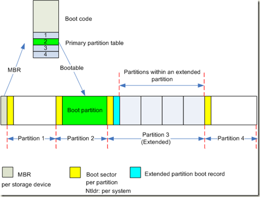
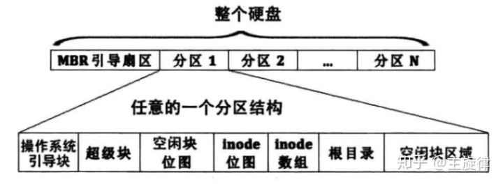

# Linux - Image

Created by : Mr Dk.

2019 / 07 / 22 15:53

Nanjing, Jiangsu, China

---

## About

`IMG` 指的是以 `.img` 文件扩展名结尾的二进制 __文件__

其中存储的内容是软盘、硬盘、光盘等存储介质上的原始二进制数据

---

## Overview

Raw image 包含了原始存储介质上每个扇区的原始数据

由于存储介质扇区上的数据组织格式和文件系统有关

因此，`.img` 文件的内部格式，与创建该映像的文件系统相同

此外，对于光盘介质的映像，应当包括光盘上所有的 tracks (轨道？)

* Audio tracks
* Data tracks
* Video tracks

不仅包括每个扇区的数据，还包括每个扇区的控制头部和错误校验区域

由于映像文件除了磁盘上的数据外没有任何的附加信息

因此只能被能够自动识别文件系统的程序处理

Linux 的发行版上已经内置了对一些文件系统映像的支持

Windows 7 以前是不支持的 需要用专门的映像解析软件 - 比如当年的精灵虚拟光驱。。

Windows 10 里面应当已经内置了映像解析了

所以安装 Office 时，下载了 `.iso` 映像文件后可以直接打开文件系统访问

---

## Partition

磁盘被分为了很多扇区：

* 其中，最开始的扇区为 MBR，用于引导系统启动
* MBR 能够找到 boot partition，即启动分区，从而启动操作系统
* 每个分区包含：
  * Boot sector - 即启动扇区
  * 之后的扇区随文件系统而异

一个典型的 Linux 系统的分区：(maybe _ext4_ FS?)

* 最开始的部分是 OS 引导块 - boot block，通常位于第一扇区中
* 之后的部分 - super block
  * 其中的 magic 指明文件系统的类型
  * 记录了所有的全局元数据
    * inode、数据块的数量
    * 数据块的 bitmap 起始地址和长度
    * 数据块的起始地址和长度
    * inode bitmap 的起始地址和长度
    * inode 数组的起始地址和长度
    * ......
  * Super block 的大小和位置是固定的，通常位于第二扇区中
* 再之后就是实际的 bitmap 和各个块的数组
  * 数组用于存放实际数据
  * bitmap 用于指示块是否被使用

不同文件系统对分区中数据的组织方式不同

而映像文件只是分区中原始数据的拷贝

因此存储格式与创建映像时的文件系统相同

---

## References

https://en.wikipedia.org/wiki/IMG_(file_format)

https://zhuanlan.zhihu.com/p/36612326

https://www.cnblogs.com/liwei0526vip/p/4998614.html

---

