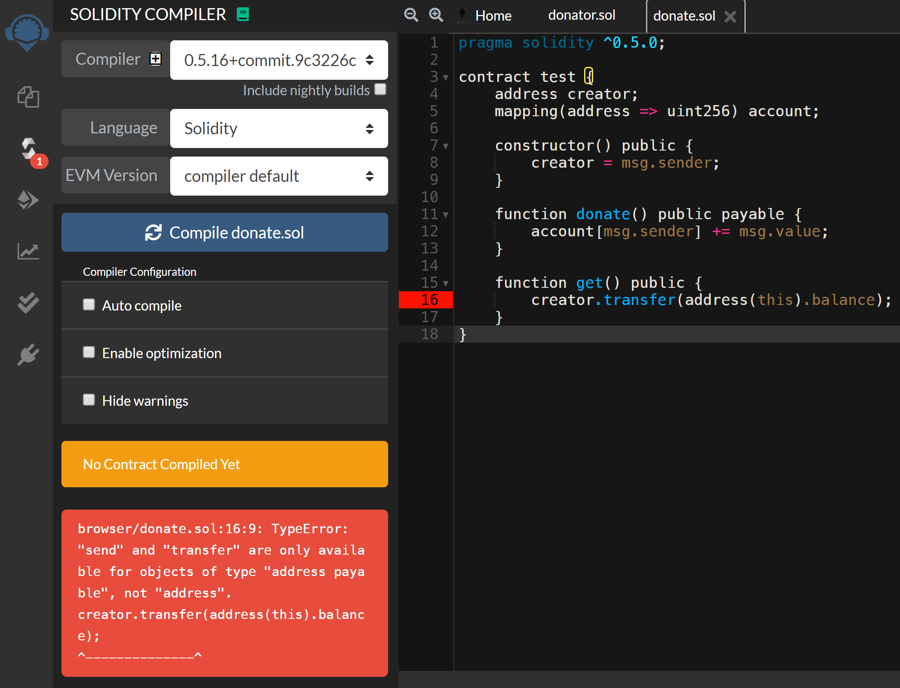

# Solidity - Remix IDE

Created by : Mr Dk.

2020 / 02 / 28 12:33

Ningbo, Zhejiang, China

---

## About _Remix_

_Remix_ 是一款 __基于浏览器__ 的 Solidity IDE，其中内置了 Solidity 编译器、代码静态分析，以及一个虚拟测试运行环境。

可以通过访问 [官方站点](https://remix.ethereum.org) 在线使用这个 IDE，也可以自己克隆代码到本地进行离线使用。个人感觉这个 IDE 无论是 UI 还是测试虚拟环境，都是比较 🉑 的。下面记录一些简单的使用方式。

## File Explorers and Editor

左边是文件资源管理器，右边是编辑器，可对源代码文件进行编辑。另外，可以从本地源代码文件或 GitHub 上进行导入。

打开 editor 后，静态分析引擎会起作用，显示出一些修改意见。可以自由开启或关闭静态分析的选项。分析工具应该是基于 [_Slither_](https://github.com/crytic/slither)。

## Compiler

在编译器界面中，可以选择编译器版本、编译语言 (因为 Remix 还支持 _Yul_)、EVM 版本。另外，编译器提供一些配置选项，比如可以开启自动编译、优化、警告忽略等。

如果编译失败，左边会有红色的框提示错误信息。

如果编译成功，就有按钮可以直接部署到一些线上平台，或者导出字节码和 ABI。

## Testing Environment

Remix 提供了可以用于直接测试 contract 的环境。里面已经内置好了一些拥有少量 Ether 的账户。首先，用其中的一个账户，将刚才编译通过的 contract 部署。

部署后的合约中可被调用的函数将会在左下角以按钮的形式显示。在下方的 terminal 中会显示部署、调用所产生的交易记录及其具体信息。

其中，`constant` 或 `pure` 函数的按钮是蓝色的 - 因为这种函数不会修改合约的状态，因此调用这种函数不会创建新的交易记录；`non-payable` 函数 (即，修改 contract 状态，但不发生转账的函数) 将会是一个橙色的按钮；而 `payable` 函数的按钮是红色的。测试时可以在左上方选择调用这个函数的账户、gas limit、以及要发送的 Ether。如果函数有参数，在函数的按钮旁边会有输入框用于输入参数。然后单击按钮后，就会模拟一次函数调用行为，terminal 中会显示调用这个函数的交易记录 (如果会产生交易记录的话)。

如图，一开始，每个账号默认的货币数量是 100 Ether。使用账户 `0xCA3...a733c` 部署该合约后，消耗了一定数目的 Ether。合约部署后，合约中可以被调用的两个函数就在左下角显示出来了。这时可以换用另一个账户，调用 `payable` (红色按钮) 的 `donate()` 函数进行转账。在 Terminal 中显示了部署/调用/转账的交易记录细节。

---

## Summary

这款 IDE 的 [官方文档](https://remix-ide.readthedocs.io/en/latest/) 详细说明了 IDE 的使用方法。对于初学者来说，省去了搭环境的步骤。

---

