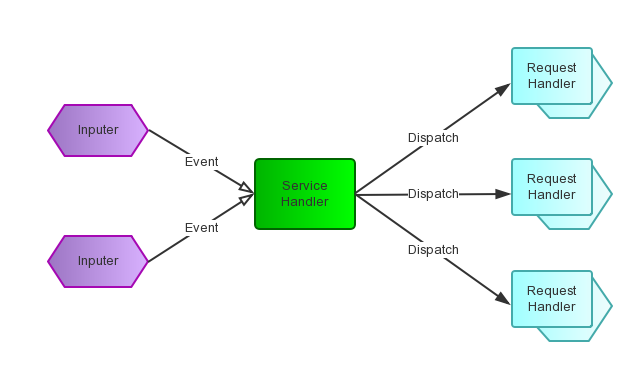

# Vert.x Core - Several Core Concepts

Created by : Mr Dk.

2018 / 10 / 31 12:25

Nanjing, Jiangsu, China

---

## About - From _Vert.x_ official

Eclipse __Vert.x__ is a tool-kit for building __reactive__ applications on the __JVM__.

* Eclipse Vert.x is __event driven__ and __non blocking__. This means your app can handle a lot of concurrency using a small number of kernel threads. Vert.x lets your app scale with minimal hardware.
* You can use Vert.x with multiple languages including __Java__, __JavaScript__, __Groovy__, __Ruby__, __Ceylon__, __Scala__ and __Kotlin__.
* Vert.x is incredibly flexible - whether it's simple network utilities, sophisticated modern web applications, HTTP/REST microservices, high volume event processing or a full blown back-end message-bus application, Vert.x is a great fit.
* Vert.x is *lightweight* - Vert.x core is around 650kB in size.
* Vert.x is *fast*. 
* Vert.x is *modular* - when you need more bits just add the bits you need and nothing more.
* ......

## Core Concept

理解这几个核心概念有助于理解 _Vert.x_ 框架

### 1. Event Driven（事件驱动）

一种程序设计模式，诞生于交互式程序中——

* 点击一个按钮后，卡住，等待处理完成后继续 - 相当于传统的 __轮询__
* 点击一个按钮后，不卡住，后台处理完成后在界面上展示 - 相当于 __中断__

基本架构 - 预先设计一个 __事件循环__（event loop）

* __事件循环__ 不断检查目前输入的 __事件__
* 事件循环根据输入的事件运行事先注册的 __触发函数__（handler）进行处理
* 在等待事件处理时，输入事件的程序可以继续执行下去，不需 __阻塞__（blocking）
* 事件处理完成后，__通知__ 输入事件的程序

事件循环模拟了一个 __中断__ 的环境

* 接收外部事件
* 分发事件到对应的触发函数（也称为回调函数）

组件与服务之间最大 __松耦合__

* 传统面向接口编程
  * 实现接口调用者和接口实现者之间的解耦
  * 解耦程度低，如果接口变化，双方代码都需要变动
* 事件驱动编程
  * 调用者与被调用者互相不知道对方，两者只和中间的消息队列耦合

### 2. React Pattern（反应器模式）

The reactor design pattern is an event handling pattern for handling service requests delivered concurrently to a service handler by one or more inputs.

The service handler then demultiplexes the incoming requests and dispatches them synchronously to the associated request handlers.

对应事件驱动，所谓的 _service handler_ 指的就是事件循环；它负责接收请求并触发响应函数 - __同步__

而对于事件的输入者来说，它向事件循环提出请求后就继续向下执行了，结果会在未来某时刻返回 - __异步__

因此，对于事件输入者来说 - 好莱坞原则（The Hollywood principle） - __Don’t call us, we’ll call you.__

Architecture

* __Resource__ - from system
* __Synchronous Event Demultiplexer__ - Send the resource to the dispatchers when it is possible to start a synchronous operation on a resource __with out blocking__
* __Dispatcher__ - Dispatches resources from the _demultiplexer_ to the associated _request handler_
* __Request Handler__ - To do works

## Features of _Vert.x_

### 1. 事件驱动、异步、非阻塞 I/O

__异步编程__ 与传统的 __多线程编程__ 有何区别：

* 单线程编程效率低下
* 多线程编程，需要写代码解决线程安全问题
* 事件驱动异步编程能够让程序尽可能得到执行

### 2. Multi-Reactor Pattern

In a standard reactor implementation there is a __single event loop thread__ which runs around in a loop delivering all events to all handlers as they arrive.

The trouble with a single thread is it can only run on a single core at any one time, so if you want your single threaded reactor application (e.g. your Node.js application) to scale over your multi-core server you have to start up and manage many different processes.

Vert.x works differently here. Instead of a single event loop, each `Vertx` instance maintains __several event loops__. By default we choose the number based on the number of available cores on the machine, but this can be overridden. This means a single `Vertx` process can scale across your server, unlike `Node.js`.

* 不要在 _event loop_ 中写阻塞代码

---

## Summary

对以上概念还是没有特别理解

可能需要在以后的实践中加以体会

---

